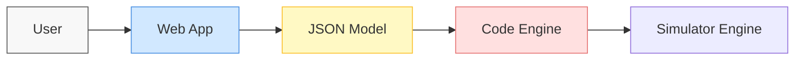

## Introduction  
---

O²DES Studio is a web-based simulation platform that is a response to challenges such as the lack of standardization across simulation tools, difficulties in team collaboration, and limitations in modeling complex systems.

This design document focuses on the architecture, components, and user-facing workflows of the O²DES Studio web application. Through a graphical interface and built-in templates, O²DES Studio allows users to visually construct models, configure simulation parameters, and analyze results—all without writing code.

---

## System Architecture & Workflow

The O²DES Studio web application is designed to act as a **bridge between visual modeling and simulation execution**. It follows a modular and decoupled architecture that separates the **frontend diagram editor**, **code generation engine**, and the **simulation backend**.

---

**High-Level Workflow**

1. **User creates a simulation model** using the drag-and-drop interface (powered by React Flow).
2. The model is **saved and represented in a standardized JSON format**.
3. This JSON is sent to a **Code Engine**, which **parses the JSON and generates simulation code** (e.g., in Java, Python, or another supported language).
4. The **generated code is executed by the Simulator** engine.

--- 
**Architecture Diagram**




---

**Tech Stack**

The O²DES Studio web application is built using a modern, modular stack that supports rapid development, intuitive user interaction, and long-term maintainability.

---

**Core Technologies**

| **Layer**            | **Technology**       | **Description**                                                       |
| -------------------- | -------------------- | --------------------------------------------------------------------- |
| **Framework**        | Next.js + TypeScript | Provides server-side rendering, fast routing, and type safety         |
| **Styling**          | Tailwind CSS         | Utility-first CSS for consistent, responsive, and maintainable design |
| **Diagramming**      | React Flow           | Node-based visual editor for intuitive drag-and-drop modeling         |
| **State Management** | Zustand              | Lightweight global state manager optimized for React apps             |

---

**Diagramming: React Flow vs mxGraph**

|**Feature**|**React Flow**|**mxGraph**|
|---|---|---|
|**Integration**|React-native, hook-based|Imperative, Java/XML-driven|
|**Learning Curve**|Easy, well-documented for React devs|Steep; requires XML + manual DOM work|
|**Customization**|Highly composable with React components|Possible, but requires deeper customization logic|
|**UI Styling**|Seamlessly integrates with Tailwind/JSX styling|Requires manual styling or custom SVG/CSS|
|**Modern React Support**|Fully supported (hooks, state sync)|Not React-aware|
|**Best For**|Interactive modeling in modern SPAs|Complex legacy enterprise tools with advanced requirements|

  Therefore **React Flow** is chosen for this project

---

**State Management: Zustand vs Redux**

|**Feature**|**Zustand**|**Redux**|
|---|---|---|
|**Boilerplate**|Minimal, direct state definition|Verbose setup with reducers/actions|
|**Learning Curve**|Very easy|Moderate to high, especially with middleware|
|**Performance**|Optimized with selective subscriptions|Good, but requires tuning with selectors/memoization|
|**Middleware Support**|Light and optional|Rich middleware ecosystem (e.g. Thunk, Saga)|
|**Use Case Fit**|Small to mid-scale UI state, real-time interactivity|Large-scale apps, complex async logic|

Therefore **Zustand** is selected due to the simplicity for rapid development. **Redux** can be reconsidered if the application increases massively in complexity

---

## O2DES Studio architecture

The frontend architecture will need a clear SoC(Separation of concerns) approach due to the frequent mixing around of states. This frontend architecture follows a layered approach with clear separation of concerns. It employs object-oriented design patterns to manage the complexity of the simulation modeling interface.

![[O2DES Studio Architecture.svg]]


---

# Core Components


## Store(Zustand)

The central state management system built on Zustand stores the current state of the simulation model, including nodes, edges, selection state, and simulation parameters.
#### Controllers

- **ViewController**: Manages the canvas view state, including zoom, pan, and viewport settings
- **NodeController**: Handles operations related to nodes, such as adding, removing, and updating
- **EdgeController**: Manages connections between nodes, including creating, removing, and modifying edges
- **CommandController**: Implements the command pattern for undo/redo functionality

--- 
#### Factories

- **NodeFactory**: Creates different types of nodes based on templates or custom configurations
- **EdgeFactory**: Generates various connection types between nodes

--- 
#### Services

- **ValidationService**: Ensures that nodes, edges, and the overall model conform to simulation requirements
- **SerializationService**: Handles saving, loading, and exporting of simulation models
- **TemplateService**: Manages built-in and custom model templates

---

## Data Flow and Interaction

The following diagram illustrates the data flow and interaction between components:

![[Data Flow.svg]]
---
	
## Component Interactions

#### Model Creation and Editing

![[Model Creation.svg]]

---

# Node Implementations

The Minimum Viable Product (MVP) version of O²DES Studio will support three fundamental simulation modeling approaches:

- Event-based simulation
- State-based simulation
- Activity-based simulation

For each paradigm, the platform will support both diagram and tableau representations. This document details the design of nodes and edges that form the foundation of all simulation models in O²DES Studio.

---
## Base Classes


### Base Node

The `BaseNode` class serves as the foundation for all node types in the system. It contains essential properties that are common across all node implementations.

```typescript
interface BaseNode {
  id: string;            // Unique identifier for the node
  type: string;          // Type of node (used for rendering and behavior)
  name: string;          // User-defined label for the node
  position: {            // Position on the canvas
    x: number;
    y: number;
  };
  data?: Record<string, any>; // Additional data specific to node type
  style?: Record<string, any>; // Visual styling properties
  
  
  //Methods
  returnId();
  returnJSX();
  returnType();
  returnName();
  returnPosition();
  returnData;
  returnStyle;
  
}
```

---
### Base Edge

The `BaseEdge` class defines the foundation for all connections between nodes in the system.

```typescript
interface BaseEdge {
  id: string;            // Unique identifier for the edge
  from: string;        // ID of the source node
  to: string;        // ID of the target node
  conditions: EdgeConditions[];// Type of edge (condition, delay, parameterized)
  label?: string;        // Optional descriptive label
  data?: Record<string, any>; // Additional data specific to edge type
  style?: Record<string, any>; // Visual styling properties 


  //Methods
  returnJSX();
  returnId();
  returnSource();
  returnTarget();
  returnConditions();
  returnLabel();
  returnData();
  returnStyle(); 
}

enum EdgeConditions {
  CONDITION = 'condition',
  DELAY = 'delay',
  PARAMETERIZED = 'parameterized'
}
```

---

Using these classes as a base, we can formulate a basic Node Factory to produce and manufacture nodes as the user requests

```typescript
class NodeFactory {
  // Registry
  private nodeTypes: Map<string, NodeCreator>;
  
  // Register a new node type
  public registerNodeType(type: string, creator: NodeCreator): void {
    this.nodeTypes.set(type, creator);
  }
  
  // Create a node of the specified type
  public createNode(type: string, position: {x: number, y: number}, data?: any): BaseNode {
    if (!this.nodeTypes.has(type)) {
      throw new Error(`Node type ${type} is not registered`);
    }
    
    const creator = this.nodeTypes.get(type);
    return creator(generateUniqueId(), position, data);
  }
}

type NodeCreator = (id: string, position: {x: number, y: number}, data?: any) => BaseNode;
```

---
Similarly, the edge factory handles the creation of different edge types.

```typescript
class EdgeFactory {
  // Registry of edge types and their creation functions
  private edgeTypes: Map<EdgeType, EdgeCreator>;
  
  // Register a new edge type
  public registerEdgeType(type: EdgeType, creator: EdgeCreator): void {}
  
  // Create an edge of the specified type
  public createEdge(source: string, target: string, type: EdgeType, data?: any): BaseEdge {}

type EdgeCreator = (id: string, source: string, target: string, data?: any) => BaseEdge;
```

---
With the types set in place, we can use a serialisation service to support saving, loading, and exporting models

```typescript
class SerializationService {
  // Serialize entire model
  public serializeModel(nodes: BaseNode[], edges: BaseEdge[]): SerializedModel {}
  
  // Serialize a single node
  private serializeNode(node: BaseNode): SerializedNode {}
  
  // Serialize a single edge
  private serializeEdge(edge: BaseEdge): SerializedEdge {}
  
  // Deserialize an entire model
  public deserializeModel(model: SerializedModel): {nodes: BaseNode[], edges: BaseEdge[]} {}
}

```

Now with all the components in place, we can start creating specialised nodes and edges for each simulation type


---
## Event-Based Simulation Nodes in O²DES Studio

In O²DES Studio, event-based simulation follows the traditional Event Graph format shown in the material, where:

- Events are represented as nodes
- Event scheduling relationships are represented as edges
- State variables are defined at the model level (not as nodes)
- Events reference and modify state variables
- Edges contain conditions that reference state variables

So we can model an event graph like this:
```typescript
interface EventBasedModel {
  nodes: EventNode[];
  edges: EventEdge[];
  stateVariables: StateVariable[];
  parameters: parameter[];
  initialEvents: InitialEvent[];
}
```

---
## Nodes

#### Initialization Node

The starting point of event graphs. It is responsible for **setting the initial values of all relevant state variables** and **scheduling the initial events** that kick off the simulation.
```typescript
InitializationNode extends BaseNode {
	initializations: String[] (MathJax C)
}
```
![[Initialization Node]]

--- 
#### Event Node


The primary building block of event-based simulation, representing a discrete occurrence that can change the system state.

``` typescript
EventNode extends BaseNode {
	stateUpdate: String (MathJax Expression)
	eventParameters?: String //Optional
}
```
![[Event Node|800]]
Note: Edges should be able to connect to the same node

---
## Edges

Edges represent the relationships between events, including scheduling and conditions, we can represent the event graph edges like this:

```typescript
interface EventGraphEdge extends BaseEdge {
	condition?: String (MathJax Notation)
	delay?: String (MathJax Notation)
	parameter?: String (MathJax Notation)
}
```
![[Event Edge|700]]

---
## Tableau Representation

In addition to the graphical diagram view, O²DES Studio supports a tableau representation for event-based simulation:
```typescript
interface EventGraphTableau {
	originEvents: originEvent[]; //Obtained from EventEdge
	stateChanges: stateChange[]; //Obtained from EventNode
	edges: number[] //Obtained from edges
	conditions: condition[] //Obtained from EventEdge
	delays: delay[] //Obtained from EventEdge
	parameters: parameter[] //Obtained from EventEdge
	destinationEvents: destinationEvent[] //Obtained from EventEdge
}
```
![[Event Tableau | 700]]

---
## Module Frame

The Module Frame component provides a mechanism to encapsulate parts of an event graph, enabling hierarchical modeling and reuse of simulation components.

```typescript
EventModuleFrame extends BaseNode {
	name: String
	model: EventBasedModel
}
```

![[Module Frame(Event)|800]]

---

## State-Based Simulation Nodes in O²DES Studio

In O²DES Studio, state-based simulation follows a modular, hierarchical structure in which:

- **State variables are encapsulated within modules**, representing distinct subsystems of the overall model
- **Modules act as “subjects”**, owning internal state transitions and responding to external events via well-defined interfaces
- **Events are represented as transitions**, not as standalone nodes, and are classified as internal, input, or output based on their source and target modules
- **State transitions drive the simulation**, with logic determined by conditions on state variables
- **Modules communicate via input/output interfaces**, supporting the composition of complex systems using a divide-and-conquer approach
- **Coupling between modules** is managed through interface events, facilitating reuse, maintainability.

A state graph can be modelled as such:
```typescript
interface StateBasedModel {
  modules: Module[];           // Subsystems with internal state and behavior
  couplings: InterfaceEdge[];  // Input/output links between modules
  parameters: Parameter[];    // Global model-level constants
  initialStates: InitialStateAssignment[];  // Starting values for each module's state
}

interface Module {
	nodes: StateNode[]
	edges: StateEdge[]
	variables: Variable[]
	initialValues: Map<variable,number>
}
```

---

## Nodes

#### State Node

A **State Node** represents a module in a state-based simulation model. It encapsulates the internal logic and state variables of a system component, functioning as an independent unit that reacts to inputs and generates outputs based on predefined transition rules.

```typescript
StateNode extends BaseNode {
	//Retains the same property as BaseNode
	delay?: String (MathJax Expression)
}
```

![[State Node|800]]

---
#### Module frame

A **Module Frame** encapsulates the internal structure and behavior of a subsystem in a state-based simulation model. It is composed of **State Nodes** and **State Edges**, which together define the module’s internal logic and transitions.

```typescript
StateModuleFrame extends BaseNode {
	name: String;
	initialValues: Map<String:number>
	stateNodes: StateNode[]
	stateEdges: StateEdges[]
	
}
```

![[Module Frame(State)|700]]

---

#### State Transition table

In state-based simulation, a **State Transition Table** formally defines the **behavior of a module** by specifying how it reacts to input events and evolves over time. Each row in the table corresponds to a **state** the module can occupy, and describes the **conditions, actions, and transitions** associated with that state.

```typescript
StateTransitionTable extends BaseNode {
	name: String
	action: String (MathJax Notation)
	timer: String (MathJax Notation)
	event: String (MathJax Notation)
	action: String (MathJax Notation)
	condition: String (MathJax Notation)
	action: String (MathJax Notation)
	nextState: String
	initialValues: String[] (MathJax Notation)
}
```

![[State Transition Table|700]]

A function can be considered to generate this table (using information from the module frame)

---
## Edges

#### State Edges

A **State Edge** represents a **transition** between two **State Nodes** (including itself) within a Module Frame in a state-based simulation model. It defines how and when control flows from one internal state to another based on simulation logic.

```typescript
StateEdge extends BaseEdge{
	from: StateNode
	to: StateNode
	condition?: String (MathJax Expression)
	event?: String (MathJax Expression)
	action?: String (MathJax Expression)
	internal?: Boolean 
}
```

![[State Edge|700]]

---
#### Interaction Edge

An **Interaction Edge** defines the **communication link** between two Module Frames in a state-based simulation model. It connects a module to another, enabling modular and scalable system composition.

```typescript
InteractionEdge extends BaseEdge {
	from: Module
	to: Module
	interaction: String
}
```

![[Interaction Edge|700]]

---
## Hybrid Notations

Sometimes, there will be **intermixing between state-based and event-based representations** in a simulation model—particularly in systems where both internal state evolution and inter-module event interactions must be clearly expressed. To support this, O²DES Studio adopts a **hybrid notation** using a **lollipop-style interface** to bridge the two paradigms.

The interface comprises of 2 interfacing nodes, the emitter and receiver node.

An **Emitter Node** is a special output interface within a Module Frame that **schedules an external event** to be sent to another module. Visually, it is represented using a **half circle notation (----( )** labeled with the **output event name** and any associated **parameters**.

```typescript
EmitterNode extends BaseEdge {
	from: EventModuleFrame || StateModuleFrame
	to: EventModuleFrame || StateModuleFrame
	description: String
	parameters?: String (Mathjax Notation)
}
```

A **Receiver Node** is a special **input interface** within a Module Frame that represents the **entry point for external events**. It is visually denoted by a **lollipop symbol (◯)** facing inward, labeled with the **input event name** and any **expected parameters**.

```typescript
ReceiverNode extends BaseEdge {
	from: EventModuleFrame || StateModuleFrame
	to: EventModuleFrame || StateModuleFrame
	description: String
	parameters?: String (Mathjax Notation)
}
```

![[Emitter Receiver Node|700]]

---

## Event-Based Simulation Nodes in O²DES Studio

In O²DES Studio, activity-based simulation captures the **flow of entities and the execution of activities** within a system using a variety of interconnected diagrammatic notations. These include **Activity Cycle Diagrams (ACD)**, **Parameterized ACDs (P-ACD)**, **Petri Nets**, and **Resource-Constrained Queue (RCQ) Diagrams**, each suited to different modeling needs and levels of abstraction.

• **Activities represent time-spanning processes** that consume and release resources, while **queues represent passive states** where entities wait to be processed

• **ACDs and P-ACDs** provide a visual structure for the logical flow of entities between active and passive states, with support for conditions and parameterization

• **Petri Nets** introduce formalism for concurrency and synchronization, using tokens and transitions to model complex state changes

• **RCQ diagrams modularize the system into components** such as generators, activities, and terminators, allowing explicit control of material flow and resource usage

• **Advanced RCQ diagrams** support **hybrid modeling**, incorporating **interface events and functional modules** like sorters and dependency handlers

• **All diagram types are unified by a common event-driven execution logic**, where transitions are triggered by conditions, resource availability, or external inputs

---

## Activity Cycle Diagrams (ACD)

An **Activity Cycle Diagram (ACD)** is a core modeling notation in activity-based simulation used to represent the **cyclic flow of entities** through active and passive states in a system. It captures both the **process logic** and the **conditions under which entities move** from one stage to another.

---

## Nodes in ACDs

ACDs have two particular types of nodes: a **passive state** and an **active state**. These nodes represent the two fundamental phases in activity-based simulation. **Passive states** (often called queues) model situations where entities are waiting for certain conditions to be met—such as resource availability or process readiness. In contrast, **active states** (activities) represent time-consuming processes where entities are engaged in some form of operation, such as service, processing, or transportation. The movement between passive and active states forms the basis of the system’s dynamic behavior.

---

#### Passive State Node

A **Passive State Node** in an Activity Cycle Diagram (ACD) represents a condition or state in which **entities are waiting** for certain criteria to be satisfied before proceeding to an activity. These nodes typically model **queues, buffers, or idle conditions**, where entities do not consume time or resources but simply await activation.

```typescript
PassiveStateNode extends BaseNode {
	tokens: String (MathJax Notation)
}
```

![[Passive State Node|800]]

---

#### Active State Node

An **Active State Node** in an Activity Cycle Diagram (ACD) represents a **time-consuming activity** that an entity undergoes once it leaves a passive state. It models the **dynamic phase of operation**, such as processing, transporting, or serving, where both **time and resources** may be consumed

```typescript
ActiveStateNode extends BaseNode {
	duration: String (MathJax Notation)
	changeInStateVariables?: String (MathJax Notation)
}
```

![[Active State Node|700]]

---
## Arcs

**Arcs** in an **Activity Cycle Diagram (ACD)** represent the **logical flow of tokens** (entities or resources) between nodes—specifically from **passive states to active states**, and from **active states back to passive states**. They define the **preconditions for activity initiation** and the **effects of activity completion**, forming the backbone of token-based execution in activity-based simulation.


```typescript
Arc extends BaseEdge {
	isResource: Boolean
	condition: String  (MathJax Notation)
	multiplicity: String (MathJax Notation)
}
```

![[ACD Edge|700]]